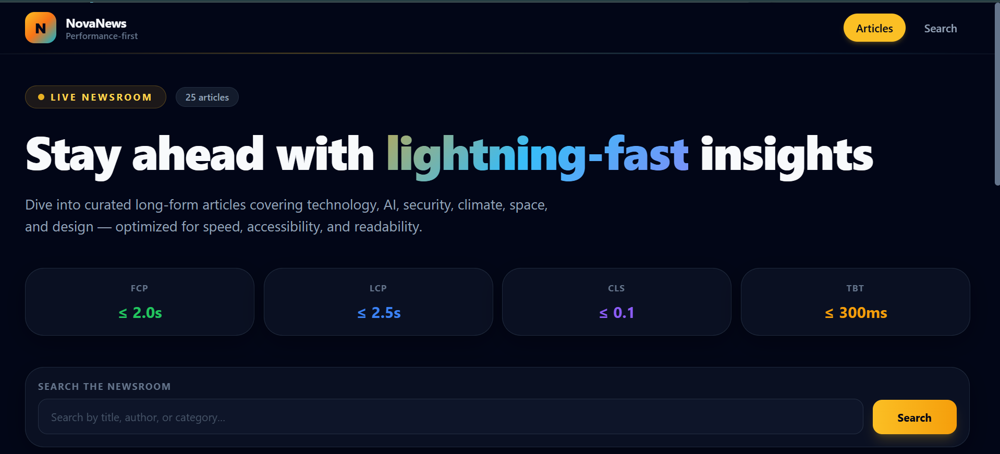
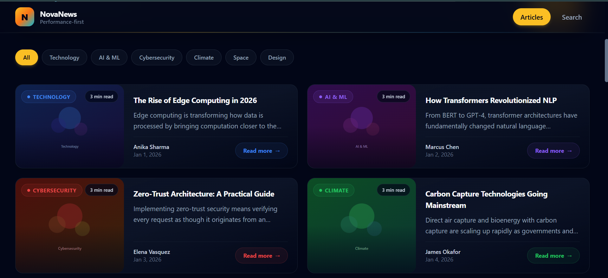
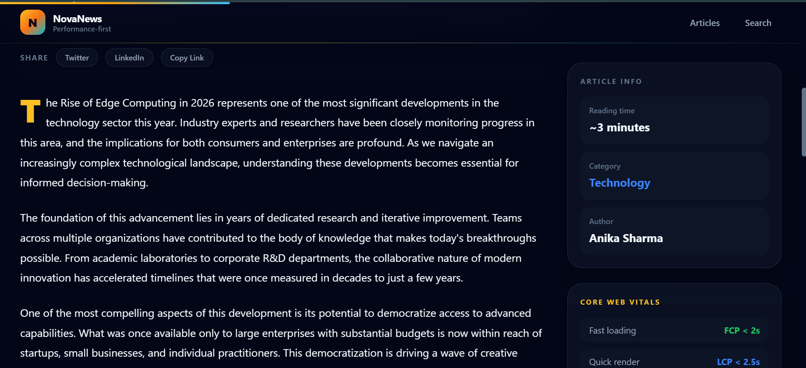
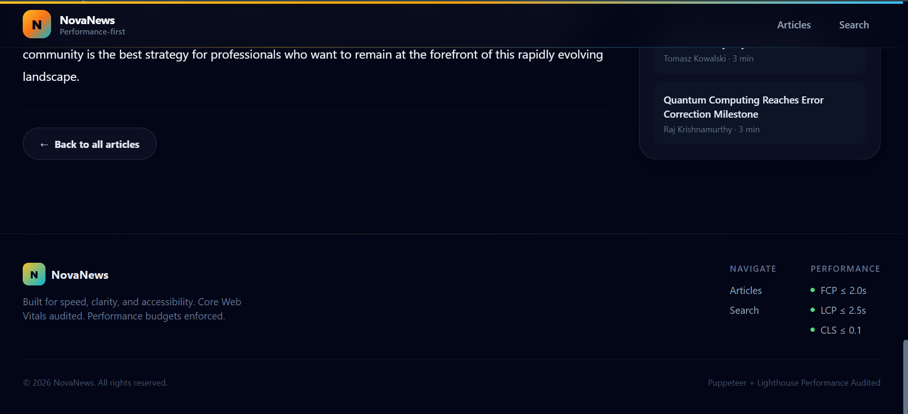

# NovaNews — Performance-first News Portal

NovaNews is a lightweight news portal built with React, TypeScript, Vite, and Tailwind CSS. It is designed to deliver fast page loads, stable layout behavior, and modern content presentation while also supporting automated Lighthouse audits through Puppeteer.

The repository includes the full application source, seeded article data, performance test harness, and generated Lighthouse reports.

---

## Quick start

1. Clone the repository:

```bash
git clone https://github.com/lohithadamisetti123/News-Portal-Puppeteer-Lighthouse.git
cd News-Portal-Puppeteer-Lighthouse
```

2. Install dependencies:

```bash
npm install
```

3. Start development mode:

```bash
npm run dev
```

4. Open the app in your browser:

```text
http://localhost:5173/articles
```

5. Build and preview production output:

```bash
npm run build
npm run preview -- --port 3000
```

6. Run performance tests:

```bash
npm run test:performance
```

---

## What is in this repo

- `src/` — React + TypeScript application code
- `public/` — static assets and app icons
- `tests/performance/` — Puppeteer and Lighthouse audit scripts
- `performance-reports/` — saved Lighthouse JSON reports
- `screenshots/` — UI preview images used in this README
- `package.json` — npm scripts and dependency definitions

---

## App overview

NovaNews renders a curated article listing page with live search, category filters, and card-based previews. Each article card includes:

- a generated SVG hero image
- a category badge with color accent
- an excerpt and article title
- author and publication date metadata
- a read-more link to a detail page

The app focuses on stable rendering, responsive layout, and good user experience with minimal animation impact.

---

## Performance goals

The project enforces a set of Lighthouse-focused budgets in the automated tests:

- Performance score: 85 or higher
- Accessibility score: 90 or higher
- First Contentful Paint (FCP): 2000ms or less
- Largest Contentful Paint (LCP): 2500ms or less
- Cumulative Layout Shift (CLS): 0.1 or less
- Total Blocking Time (TBT): 300ms or less

These targets are validated in `tests/performance/lighthouse-articles.test.cjs` and `tests/performance/lighthouse-detail.test.cjs`.

---

## How the performance tests work

The automated Lighthouse tests follow a simple flow:

1. Launch a local preview server on port `3000`.
2. Open a headless Chromium instance with Puppeteer.
3. Navigate to the target page under test.
4. Run Lighthouse in lab mode.
5. Save the resulting JSON into `performance-reports/`.
6. Compare key metrics against the configured budgets.

If any budget is exceeded, the test exits with a non-zero status so CI can catch regressions.

---

## Recent improvements

The app has been refined with several stability and performance improvements:

- explicit `aspect-ratio` handling for images to reduce layout shift
- responsive card layout that avoids clipping on desktop and mobile
- inline SVG article placeholders to avoid slow remote image loads
- consistent content container sizing across screens
- Tailwind-based styling for clean dark-mode UI

---

## Screenshots

Below are example app views from the current implementation. These images are stored in the repository root `screenshots/` folder.

### Articles page



### Article preview card



### Read More



### Footer



---

## Local commands

- `npm run dev` — run the Vite development server
- `npm run build` — compile the production bundle
- `npm run preview -- --port 3000` — preview the production build locally
- `npm run test:performance` — execute Lighthouse audits for `/articles` and `/article/1`

---

## Notes for reviewers

- Confirm the preview server is running before executing `npm run test:performance`.
- The `screenshots/` folder contains visual evidence of the current homepage and card design.
- The project is built to keep UI and performance aligned, so visual updates should preserve the Lighthouse budgets.

---

## Troubleshooting

- If `npm install` fails, delete `node_modules/` and `package-lock.json`, then retry.
- If the preview server does not respond on port `3000`, make sure no other process is using that port.
- If Lighthouse budgets fail, check the generated JSON reports in `performance-reports/` for details.

